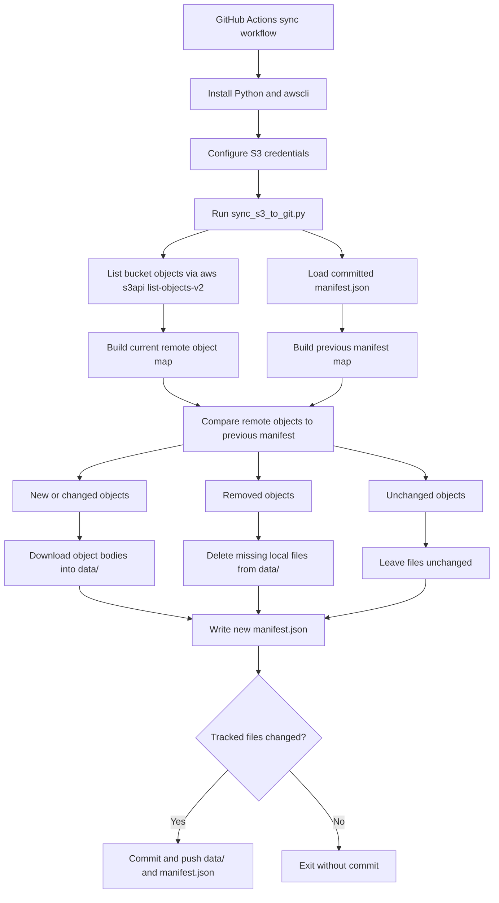

# sync-to-git

Sync objects from an S3-compatible bucket into a Git repository.

This template is designed for storage-backed snapshots that you want versioned in Git. It mirrors object bodies into a tracked directory, keeps a manifest of remote metadata, and commits changes only when the source bucket changes.

Compatible targets include:

- AWS S3
- Cloudflare R2
- MinIO
- Ceph Object Gateway (RGW)

## Example Use Case: Joplin Or Obsidian Sync Backup

One concrete use case for this template is backing up a Joplin or Obsidian sync bucket into Git.

For example:

- Joplin or Obsidian sync data lives in a Cloudflare R2 bucket
- this repo mirrors that bucket into `data/`
- every successful run updates `manifest.json`
- Git history gives you a versioned trail of note and resource changes over time

The same pattern works for other object-backed exports, archives, generated artifacts, or application snapshots as long as the source is exposed through an S3-compatible API.

## How To Use This Template

1. Create a new repository from this template.
2. Decide which bucket you want to mirror.
3. Add the required repository secrets.
4. Add repository variables for the non-sensitive settings you want to control from GitHub.
5. Optionally change the cron schedule in the workflow.
6. Run the workflow manually once with `workflow_dispatch` to validate the setup.
7. Review the committed `data/` and `manifest.json` output.

### Required Repository Secrets

- `S3_ACCESS_KEY_ID`: access key ID
- `S3_SECRET_ACCESS_KEY`: secret access key

These are the only values that should normally be stored as secrets in the stock workflow.

### Repository Variables

- `S3_BUCKET_NAME`: bucket name to mirror
- `S3_ENDPOINT_URL`: custom endpoint for S3-compatible systems such as R2, MinIO, or Ceph RGW
- `S3_REGION`: region value used by the AWS CLI; defaults to `us-east-1` if not set
- `ENABLE_NIGHTLY_SYNC`: set to `true` to allow scheduled cron runs to execute; if unset or not `true`, scheduled runs are skipped
- `SYNC_DIR`: output directory for mirrored objects; defaults to `data`
- `SYNC_MANIFEST_PATH`: manifest file path; defaults to `manifest.json`

### Other Configurable Options

These are supported by the script or workflow but are not typically stored as repository settings:

- `VERBOSE_LOG`: enables per-object logging; in GitHub Actions this is exposed through the manual workflow input

The stock workflow already reads `S3_BUCKET_NAME`, `S3_ENDPOINT_URL`, `S3_REGION`, `SYNC_DIR`, and `SYNC_MANIFEST_PATH` from repository variables, so you do not need to edit YAML for those common settings.

### Provider Notes

- AWS S3: usually leave `S3_ENDPOINT_URL` unset and set `S3_REGION` to the bucket's AWS region, such as `us-east-1`
- Cloudflare R2: set `S3_ENDPOINT_URL` to the account endpoint and use `S3_REGION=auto`
- MinIO: set `S3_ENDPOINT_URL` to your server URL; many setups work with `S3_REGION=us-east-1`
- Ceph RGW: set `S3_ENDPOINT_URL` to your gateway URL; region expectations depend on your deployment

Suggested baseline for most repos:

- store `S3_ACCESS_KEY_ID` and `S3_SECRET_ACCESS_KEY` as repository secrets
- store `S3_BUCKET_NAME`, `S3_ENDPOINT_URL`, `S3_REGION`, `SYNC_DIR`, and `SYNC_MANIFEST_PATH` as repository variables

### Nightly Enablement

- the workflow is safe for template repositories because scheduled runs are gated by the repository variable `ENABLE_NIGHTLY_SYNC`
- manual `workflow_dispatch` runs still work even when `ENABLE_NIGHTLY_SYNC` is unset
- to enable nightly syncs in a real repo, add a repository variable named `ENABLE_NIGHTLY_SYNC` with the value `true`

### Cron Behavior

- the current cron is `17 9 * * *`
- GitHub cron expressions are interpreted in UTC
- that means this workflow is scheduled for `09:17 UTC` every day
- change the cron directly in [.github/workflows/sync-s3-to-git.yml](.github/workflows/sync-s3-to-git.yml) if you want a different schedule

### First Run

After secrets and variables are configured, start with a manual run from the Actions tab. That lets you confirm credentials, endpoint settings, and output layout before enabling the nightly schedule.

## Repository Layout

- `data/`: tracked copy of synced objects
- `manifest.json`: metadata snapshot from the previous successful sync
- `.github/scripts/sync_s3_to_git.py`: sync script
- `.github/workflows/sync-s3-to-git.yml`: scheduled sync workflow
- `.github/workflows/test-sync-script.yml`: CI test workflow
- `tests/test_sync_s3_to_git.py`: local-only integration tests with a fake `aws` executable

## Architecture

The sync process is manifest-driven.

1. GitHub Actions starts the sync workflow on a schedule or manual dispatch.
2. The workflow installs Python and `awscli`.
3. The workflow configures credentials for the target S3-compatible API.
4. The Python script lists all objects in the configured bucket through `aws s3api list-objects-v2`.
5. The script loads the previous `manifest.json`.
6. The script compares remote object metadata against the previous manifest.
7. Only new or changed objects are downloaded into `data/`.
8. Files that no longer exist in the bucket are deleted from `data/`.
9. A new `manifest.json` is written.
10. The workflow commits `data/` and `manifest.json` if anything changed.

The manifest is the state bridge between runs. It avoids re-downloading unchanged objects and lets the script detect deletions.



## What Gets Compared

Each object is compared using:

- `Key`
- `Size`
- `ETag`
- `LastModified`

An object is treated as changed if any of those values differ from the previous manifest entry.

## Sync Workflow

The main workflow is [.github/workflows/sync-s3-to-git.yml](.github/workflows/sync-s3-to-git.yml).

It runs on:

- a cron schedule: `17 9 * * *`
- manual dispatch through the GitHub Actions UI

Manual dispatch supports:

- `verbose_log`: enables per-object logging

The workflow:

- checks out the repo
- sets up Python 3.12
- installs `awscli`
- configures S3 credentials
- runs the sync script
- commits and pushes changes if `data/` or `manifest.json` changed

## Sync Script

The sync script is [.github/scripts/sync_s3_to_git.py](.github/scripts/sync_s3_to_git.py).

Environment variables:

- `S3_BUCKET_NAME`: required
- `S3_ENDPOINT_URL`: optional
- `VERBOSE_LOG`: optional, truthy values are `1`, `true`, `yes`, `on`
- `SYNC_DIR`: optional, defaults to `data`
- `SYNC_MANIFEST_PATH`: optional, defaults to `manifest.json`
- `GITHUB_STEP_SUMMARY`: optional, used by GitHub Actions for Markdown summaries

Behavior:

- creates the sync directory if missing
- lists bucket contents page by page
- loads the previous manifest if present
- classifies objects as new, changed, removed, or unchanged
- downloads only new and changed objects with `aws s3 cp`
- removes local files that no longer exist remotely
- prunes empty directories under the sync directory
- writes a fresh manifest
- emits GitHub notices, warnings, and a step summary in Actions

## Local Real Run

You can run the real sync locally if you have valid credentials and `awscli` installed.

AWS S3 example:

```bash
export S3_ACCESS_KEY_ID=...
export S3_SECRET_ACCESS_KEY=...
export S3_BUCKET_NAME=your-bucket
export S3_REGION=us-east-1

aws configure set aws_access_key_id "$S3_ACCESS_KEY_ID"
aws configure set aws_secret_access_key "$S3_SECRET_ACCESS_KEY"
aws configure set default.region "${S3_REGION:-us-east-1}"

python3 .github/scripts/sync_s3_to_git.py
```

Cloudflare R2 or MinIO example:

```bash
export S3_ACCESS_KEY_ID=...
export S3_SECRET_ACCESS_KEY=...
export S3_BUCKET_NAME=your-bucket
export S3_ENDPOINT_URL=https://your-endpoint
export S3_REGION=us-east-1

aws configure set aws_access_key_id "$S3_ACCESS_KEY_ID"
aws configure set aws_secret_access_key "$S3_SECRET_ACCESS_KEY"
aws configure set default.region "${S3_REGION:-us-east-1}"

python3 .github/scripts/sync_s3_to_git.py
```

Verbose mode:

```bash
VERBOSE_LOG=true python3 .github/scripts/sync_s3_to_git.py
```

Custom paths:

```bash
SYNC_DIR=snapshots SYNC_MANIFEST_PATH=s3-manifest.json python3 .github/scripts/sync_s3_to_git.py
```

## Tests

The test suite does not talk to real infrastructure.

The tests in [tests/test_sync_s3_to_git.py](tests/test_sync_s3_to_git.py):

- run the real sync script in a temporary directory
- place a fake `aws` executable first on `PATH`
- return fixture JSON for `aws s3api list-objects-v2`
- copy fixture object bodies for `aws s3 cp`
- verify first-run sync, incremental changes, deletions, downloads, and summary output

This exercises the subprocess-based integration path without touching AWS, R2, MinIO, or any real bucket.

## Run Tests Locally

```bash
python3 -m unittest discover -s tests -p 'test_*.py' -v
```

## CI Test Workflow

The CI workflow is [.github/workflows/test-sync-script.yml](.github/workflows/test-sync-script.yml).

It runs on:

- `push`
- `pull_request`
- manual dispatch

It:

- checks out the repo
- sets up Python 3.12
- runs `python -m unittest discover -s tests -p 'test_*.py' -v`

## Process

1. A scheduled or manual workflow run starts.
2. The script compares the current bucket state with `manifest.json`.
3. The repo changes only if the remote bucket changed.
4. GitHub Actions commits the new snapshot back to the default branch.
5. The committed manifest becomes the baseline for the next run.

## Operational Notes

- The cron schedule is embedded in the workflow YAML. GitHub Actions does not read schedule triggers from a separate repo file at runtime.
- Scheduled runs are skipped unless `ENABLE_NIGHTLY_SYNC=true` is set as a repository variable.
- If no changes are detected, the workflow exits without creating a commit.
- Nested object keys are preserved as nested paths under `data/`.
- Deletions in the source bucket are reflected locally on the next successful run.
- The manifest is sorted by object key before being written.
- The current template syncs a single bucket into a single tracked directory.

## Customizing This Template

The simplest ways to customize it are:

- change the cron schedule in [.github/workflows/sync-s3-to-git.yml](.github/workflows/sync-s3-to-git.yml)
- change `SYNC_DIR` and `SYNC_MANIFEST_PATH` in the workflow
- extend the script if you want filtering, multiple buckets, or different commit behavior

When changing script behavior, update the tests in the same commit.
